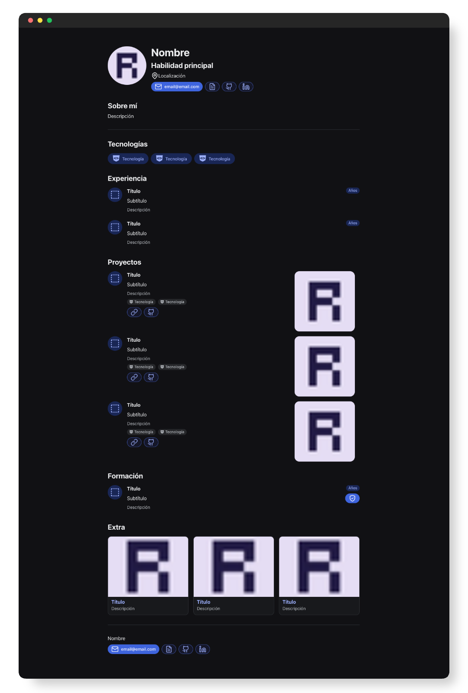
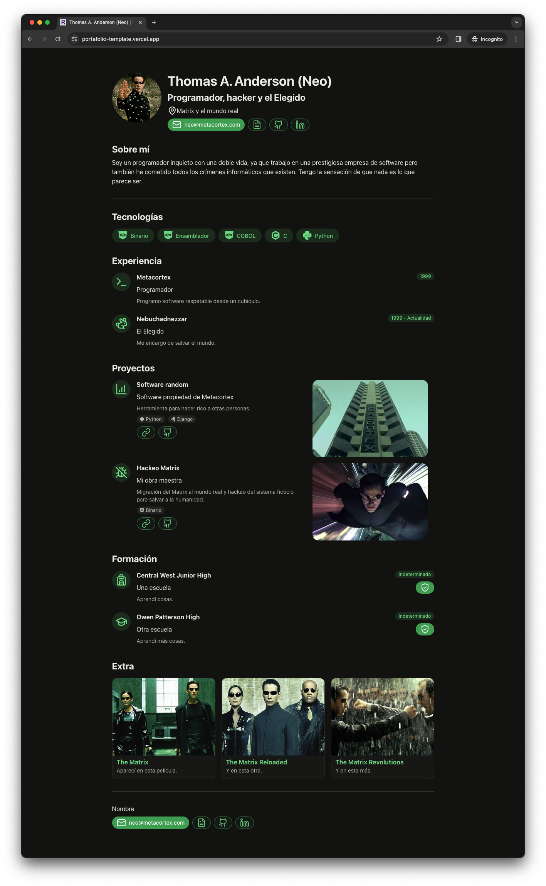

# "Perfect" Portfolio for Programmers

## Minimalist web portfolio template configurable in terms of graphics and content

Developed using [Python](https://python.org) and [Reflex](https://reflex.dev), available for static deployment (HTML, CSS, JS).

## Portfolio

After looking at many other portfolio/resume templates, I created a schema to reflect the mandatory, recommended, optional, and discouraged information for my portfolio as a developer.

With this premise, I developed this web project that accurately reflects all the information of our "perfect portfolio."

## Project

Web template for programmers developed with the premise of creating the "perfect portfolio," including all essential sections and information.

* Avatar and main details
* Contact information, CV, and social networks
* About me
* Technologies
* Experience
* Projects
* Training
* Extras

**Demo: [https://portfolio-template.vercel.app/](https://portfolio-template.vercel.app/)**

## Installation

You can follow the [official guide](https://reflex.dev/docs/getting-started/installation/) of Reflex.

Clone the project, create a virtual environment, install Reflex, and run it to access the project from [http://localhost:3000](http://localhost:3000).

`pip install reflex`

`reflex init`

`reflex run`

## Configuration

You can mainly configure the content and the graphical aspect of the website.

* Content: Edit the file [data.json](./assets/data/data.json) with your portfolio information.
	* Optional fields within `experience`, `projects`, and `training`: *technologies, date, certificate, image, url, and github*.
	* General icons correspond to the identifiers of [Lucide icons](https://lucide.dev/icons/).
	* Technology icons correspond to the identifiers of [Devicon](https://devicon.dev/).
* Theme: Edit the graphical theme of the web.
	* Uncomment the line `rx.theme_panel()` in `portfolio.py`.
	* Start the project, select the configuration you want, and click `Copy Theme`.
	* Add that information within `theme=rx.theme()` in `portfolio.py`.

## Deployment

The project uses [Vercel](https://vercel.com) for static resource hosting.

Automatic deployment is configured from the files [vercel.json](./vercel.json) and [build.sh](./build.sh).

Here is the [demo](https://portfolio-template.vercel.app/).
